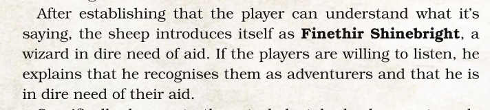

# The Wild Sheep Chase One Shot

## Table Of Contents

- [Walkthrough](#walkthrough)
  - [Starting Locations](#starting-locations)
  - [Kick Off](#kick-off)
  - [Shepherds, Crooks Encounter](#shepherds-crooks-encounter)
  - [After the Dust Settles](#after-the-dust-settles)
- [Characters](#characters)
  - [Finethir Shinebright](#finethir-shinebright)
  - [Guz](#guz)
- [Location](#location)
  - [Triboar](#triboar)

## Walkthrough

### Starting Locations

- Talking Troll (Tavern)
- Frost-Touched Frog (Inn)
- Caravan Campgrounds
- Pleasing Platter
- Walking Down a Road

### Kick Off

- Adventurers can be anywhere in [town](#triboar) but need to be together
- Sheep is [Shinebright](#finethir-shinebright)
- Possibly make them roll perception for Shinebright hooves when he enters?
- Shinebright needs to get them to read the scroll
- What happens if they dont?
- Shinebright needs to explain himself and what he needs to get
  
- Interrupt Shinebright with Shepherds Crooks encounter

### Shepherds, Crooks Encounter



Enemies: [Guz](#guz), 3 [Wolves](https://roll20.net/compendium/dnd5e/Wolf), [Brown Bear](https://roll20.net/compendium/dnd5e/Brown%20Bear#content)

- All beast are humans polymorphed
- Guz demands "Master Noke's sheep"
- Will take bribes
- Any mention of the sheeps true nature is laughed off
- Guz prefers violence but will talk. If he doenst make progess will start
- Wolves try to flank while party focuses on Guz and Bear
- Trying to capture sheep
- If party sneaks away Guz will be seen later. Keep track of that

### After the Dust Settles

### Characters

#### Finethir Shinebright

##### Stats

Int is 18 and Wis is 14

##### Roleplay

#### Guz

##### Stats

##### Roleplay

## Location

### Triboar

#### General Info

Lively crossroads town in the North. Full of roaming merchants, caravaners, and other travelers.

Some locals called it “the Gateway of the North”

The god of rangers, Gwaeron Windstorm, was often seen walking the land around Triboar

Long running treasure tale revolving around the so-called Lost Guide. A wagon driver who disappeared between Triboar and Yartar while transferring gold. Outsiders believe his wagon and gold lay in the bottom of the Desserin River

#### Links

- [Interactive Map](https://forgottenmaps.com/triboar/)
- [Map Image](images/Triboar_5e.webp)
- [Wiki](https://forgottenrealms.fandom.com/wiki/Triboar)
