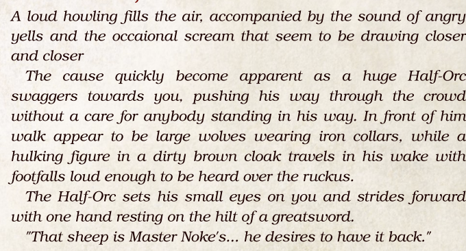
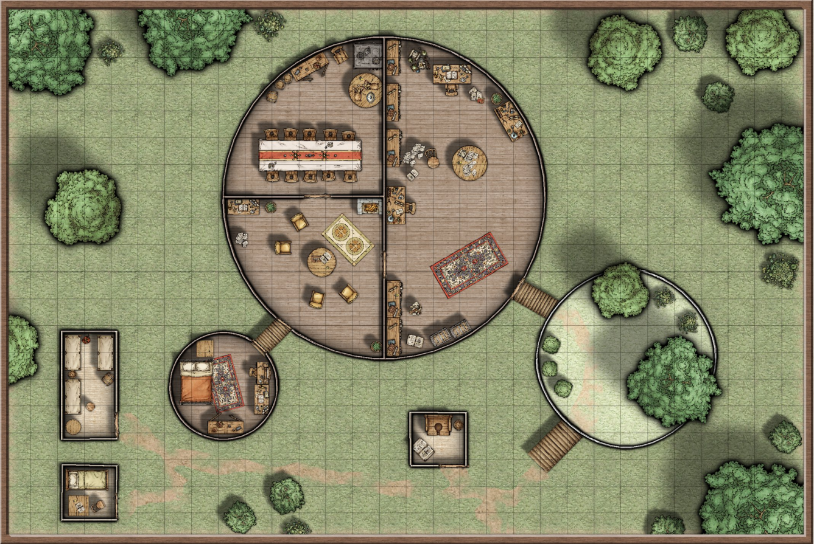
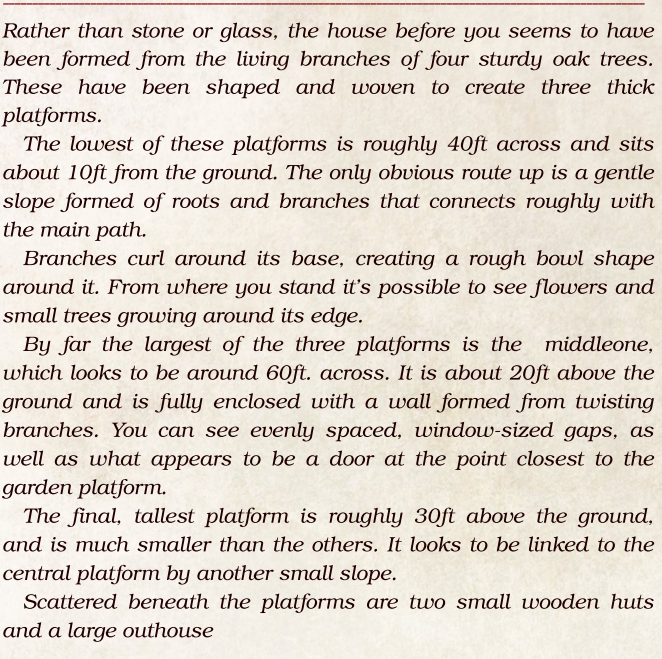
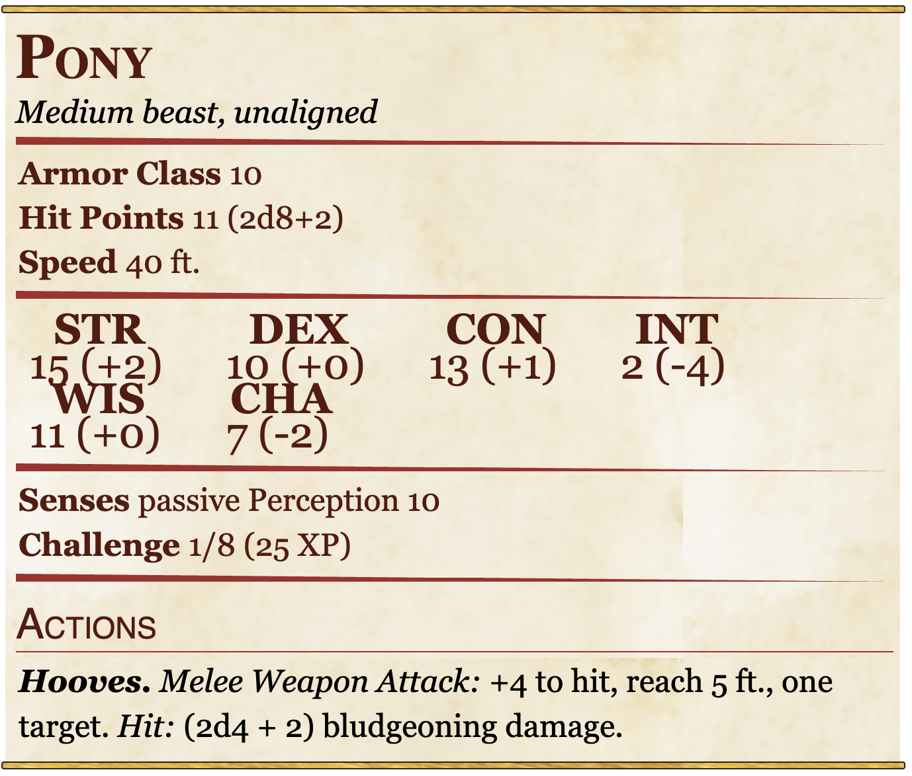
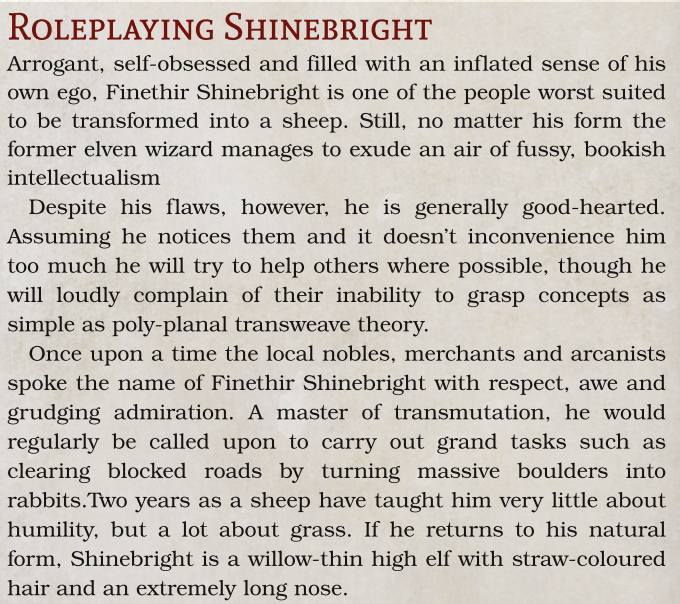
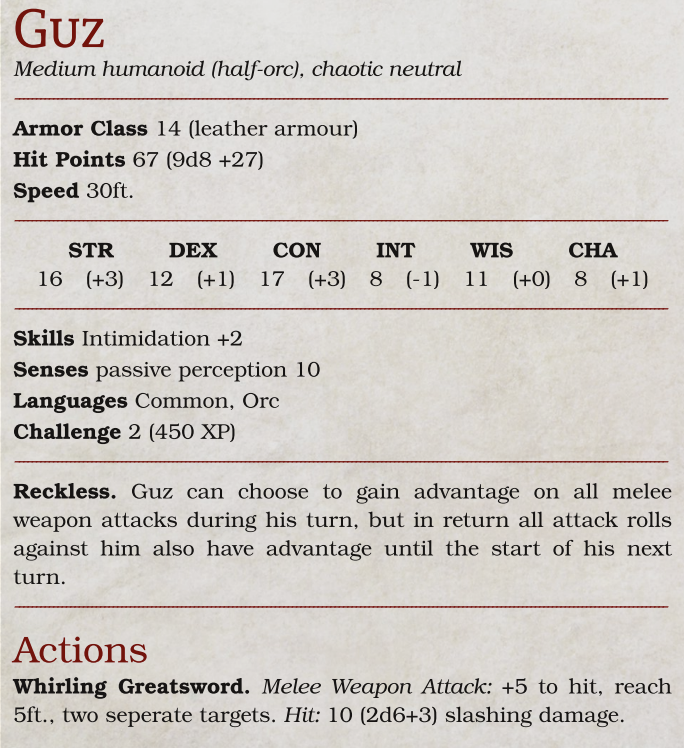
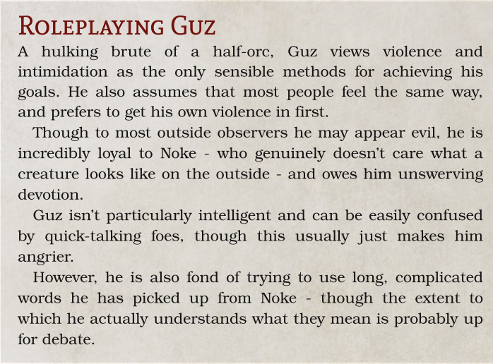
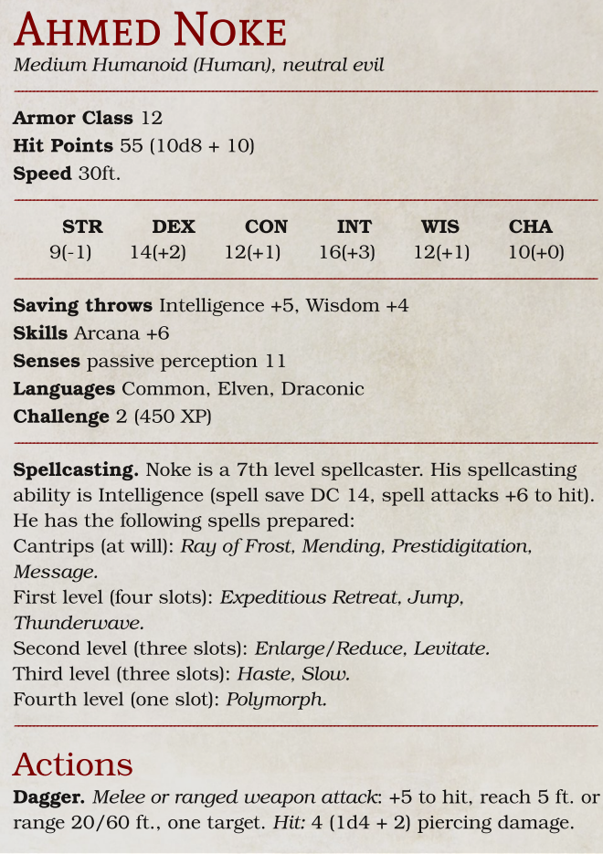
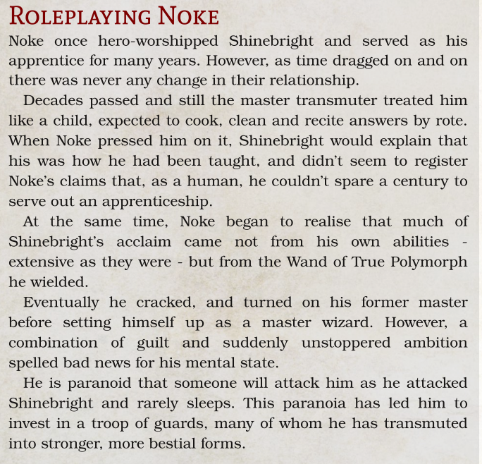

# The Wild Sheep Chase One Shot

## Table Of Contents

- [Walkthrough](#walkthrough)
  - [Starting Locations](#starting-locations)
  - [Kick Off](#kick-off)
  - [Shepherds, Crooks Encounter](#shepherds-crooks-encounter)
  - [After the Dust Settles](#after-the-dust-settles)
  - [The House in the Woods](#the-house-in-the-woods)
- [Characters](#characters)
  - [Finethir Shinebright](#finethir-shinebright)
  - [Guz](#guz)
  - [Ahmed Noke](#ahmed-noke)
- [Location](#location)
  - [Triboar](#triboar)

# Walkthrough

Step by step walk through of the campaign reminding the DM of what they should hit home.

## Starting Locations

- Talking Troll (Tavern)
- Frost-Touched Frog (Inn)
- Caravan Campgrounds
- Pleasing Platter
- Walking Down a Road

## Kick Off

- Adventurers can be anywhere in [town](#triboar) but need to be together
- Sheep is [Shinebright](#finethir-shinebright)
- Possibly make them roll perception for Shinebright hooves when he enters?
- Shinebright needs to get them to read the scroll
- What happens if they dont?
- Shinebright needs to explain himself and what he needs to get
  
- Interrupt Shinebright with Shepherds Crooks encounter

## Shepherds, Crooks Encounter

Enemies: [Guz](#guz), 3 [Wolves](https://roll20.net/compendium/dnd5e/Wolf), [Brown Bear](https://roll20.net/compendium/dnd5e/Brown%20Bear#content)

- All beast are humans polymorphed
- Guz demands "Master Noke's sheep"
- Will take bribes
- Any mention of the sheeps true nature is laughed off
- Guz prefers violence but will talk. If he doenst make progess will start
- Wolves try to flank while party focuses on Guz and Bear
- Trying to capture sheep
- If party sneaks away Guz will be seen later. Keep track of that

## After the Dust Settles

If the party is feeling mercenary Shinebright can remind the party that as a wizard he's very powerful

The goal is to get the party to go to his house.

### His Story

Until 2 years ago he owned and worked out of a towner on the outskirts. He specialized in transmutation. His most prized posession with an incredibly rare Wand of True Polymorph.

One night he ended his meditative trance to find his apprentice [Ahmed Noke](#ahmed-noke) standing over him clutching the wand. Shinebright demanded to know what he was doing but all he heard was "baaaah".

He became a prisoner to his own garden. Noke polymorphed guards

The night prior Noke left his home without closing the door and he snuck out. He grabbed the Scroll of Speak to Animals before he left.

In order to turn back to his original form he needs another dose of True Polymorph which means he needs access to his old wand

He knows his old home's layout and is more than happy to describe it

## The House in the Woods

The path to the tower cuts off from the main road a few miles out of town.

If anyone examines the path for tracks they will find a fresh pair from [Guz](#guz).

### Encounter

3 Apes sleeping or playing with an oversized pair of dice in the lawn.

A Brown Bear in the outhouse, taking care of business

Enemies: 3 [Apes](https://roll20.net/compendium/dnd5e/Ape#content) and a [Brown Bear](https://roll20.net/compendium/dnd5e/Brown%20Bear#content)

Apes act smart and wield greatswords. Fist is replaced by a Slash 2d7+3 damage.

None will fight to death and will flee if below half health.

The door to the central platform is locked. DC14 (Athletics) to break down or DC12 Thieves Tools.

### Noke Enters

[Noke](#ahmed-noke) is in the central platform working.

If the party approaches he will tell the party to return the sheep or he will destroy them

If they talk he will reveal why he hates [Shinebright](#finethir-shinebright). He will also ask if his "main man" [Guz](#guz) was killed and will be visibly upset if they have.

If the party does not return Shinebright Noke will fight.

Once the Brown Bear exits the outhouse Noke will cast Enlarge/Reduce on it to increase its damage.

He will mainly use Ray of Frost but will focus on keeping concentration

Once the fight is lost or players get too close Noke will cast Expeditous Retreat and flee locking the door behind him.

He will move to his bedrom and cast True polymorph on his bed.

3 rounds after he runs away from the roof a [Bed Dragon Wyrmling](data/Dragon_Stats.png) will emerge. It looks like its carved from wood, with billowing bedsheets for wings and a tail that ends in a soft pillow. If the party are in the main living area he will crash through the ceiling and attack.

Dragon is not smart and will use Splinter Breath as **often as possible**. It will prioritize enemies who use fire against it. Noke, while riding, will use Ray of Frost.

Should the dragon die or Noke loses concentration it will return to a bed.

Noke will them use the wand on himself and turn himself into a [Gibbering Mouther](https://www.dndbeyond.com/monsters/16901-gibbering-mouther?srsltid=AfmBOooL_B_YZBl3djiNecfrpyMH6Ss58M5WHvZHiONL42wFTNbpkBnn).

# Characters

## Finethir Shinebright

Int is 18 and Wis is 14

## Guz

## Ahmed Noke

# Location

## Triboar

### General Info

Lively crossroads town in the North. Full of roaming merchants, caravaners, and other travelers.

Some locals called it “the Gateway of the North”

The god of rangers, Gwaeron Windstorm, was often seen walking the land around Triboar

Long running treasure tale revolving around the so-called Lost Guide. A wagon driver who disappeared between Triboar and Yartar while transferring gold. Outsiders believe his wagon and gold lay in the bottom of the Desserin River

### Links

- [Interactive Map](https://forgottenmaps.com/triboar/)
- [Map Image](images/Triboar_5e.webp)
- [Wiki](https://forgottenrealms.fandom.com/wiki/Triboar)
